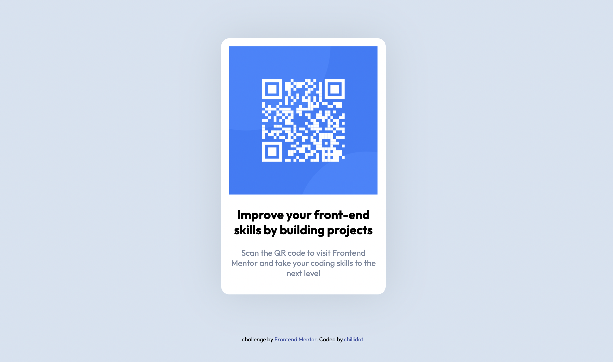

# Frontend Mentor - QR code component solution

This is a solution to the [QR code component challenge on Frontend Mentor](https://www.frontendmentor.io/challenges/qr-code-component-iux_sIO_H). Frontend Mentor challenges help you improve your coding skills by building realistic projects. 

## Table of contents

- [Overview](#overview)
  - [Screenshot](#screenshot)
  - [Links](#links)
- [My process](#my-process)
  - [Built with](#built-with)
  - [What I learned](#what-i-learned)
- [Author](#author)

**Note: Delete this note and update the table of contents based on what sections you keep.**

## Overview

### Screenshot



### Links

- Solution URL: https://github.com/Chillidot/qrCode
- Live Site URL: [https://chillidot.github.io/qrCode/

## My process

### Built with

- Semantic HTML5 markup
- CSS custom properties
- Flexbox
- Desktop-First Workflow

### What I learned

Avoid stretched images in Safari-Browser using Flexbox.
--> Put images in extra section/container.
--> Make them responsive.

```html
    <section>
      
    </section>
```
```css
img{
    max-width: 100%;
    height: auto;
}
```

## Author

- Frontend Mentor - [@chillidot](https://www.frontendmentor.io/profile/chillidot)